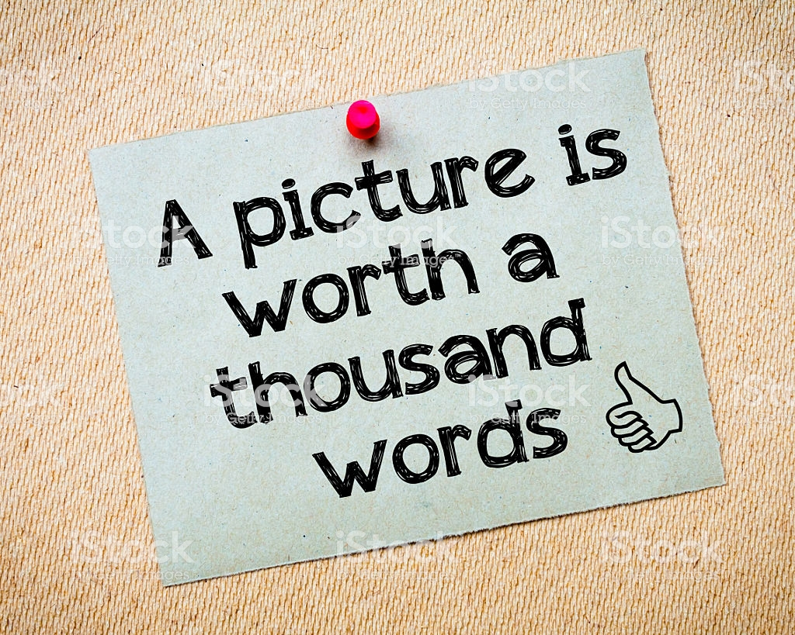

# Instagram Engagement Prediction

## *Is a Picture Worth a Thousand Words?*

  

## Task 

We all have heard the Adage, "A Picture is worth a thousand words". As of 2018, Instagram has over 1 Billion active users and among these users, more than 90% follow at least one business on the platform, implying that the users would like to hear from the brands. For the same reason, Instagram has become a favorite platform for influencer marketing. 

Over the years, due to the increased internet connectivity across the globe, images and videos have contributed to the big data than the traditional textual information. This project uses statistical methods to predict the engagement of the National Geographic page using the captions (text) and labels (labels extracted from the image). More importantly, the project explore whether "A Picture is worth a thousand words" or not! 

## Evaluation 

The various models built was evaluated using the Area Under the Receiver Operating Characteristic curve (AU-ROC). 

## Approach

1) Data Extraction from instagram using Instaloader package
2) Extracted labels from the images using [Google Vision API](https://cloud.google.com/vision/)
3) Create Engagement metric (weighted average of number of likes and comments) 
4) Models to predict engagement 
5) Topic modelling using Latent Dirichlet Allocation (LDA) for creative recommendations

## Models built
1) Logistic regression using TF-IDF features from Captions --> AU-ROC 0.78 
2) Logistic regression using TF-IDF features from Labels --> AU-ROC 0.80
3) Logistic regression using TF-IDF features from both Captions and Lables --> AU-ROC 0.82

## Results 

####  Based on the results of topic modelling:

- NatGeo should limit photos of marine life as 44% of photos tagged with Marine related images seems to have relatively low engagement scores
- Wildlife and Landscape related posts should be increased as they drive higher engagement
- Nature seems to be a neutral topic and not contributing to the engagement

#### Based on the results of logistic regression:

- Using both caption and image labels from google vision results in the best AUROC scores (82%)
- Caption only logistic regression resulted in an AUROC score of 0.78
- Label only logistic regression results in an AU-ROC score of 0.80

## Future Work

1) It is possible that the image and textual data are correlated, hence, dimension reduction methods such as Principal Component Analysis or Linear Discriminant Analysis can be used to get uncorrelated features 

2) Use other features from the google vision API 

### Coming back to our question, Clearly the labels from google visions results adds a boost in the engagement prediction! Indeed, a picutre is worth a thousand words!!

  

Source: https://www.istockphoto.com/photo/one-picture-is-worth-a-thousand-words-gm471407786-62749412
